# Architecture Documentation

This document provides a comprehensive overview of the SaaS Go App architecture, with a focus on the leader/follower database pattern implementation.

## What This Application Does (Plain Language)

**The SaaS Go App** is a demonstration web application that showcases how to build a modern, scalable SaaS (Software as a Service) application using best practices. Think of it as a simple customer management system where you can:

- **Manage Customers**: Create, view, update, and delete customer records
- **Manage Accounts**: Each customer can have multiple accounts (like subscription tiers or service plans)
- **View Analytics**: See dashboard statistics like total customers, active accounts, and averages
- **Secure Access**: Users must log in with a username and password to access the system

**The Real Value**: This application demonstrates how to leverage **Heroku Postgres Advanced (Next Generation)** to automatically handle database scaling and performance optimization without complex application code. Instead of managing separate database connections for different types of queries, you use a single connection and let the database intelligently route:
- **Write operations** (creating/updating data) → Leader database
- **Read operations** (viewing data, analytics) → Follower pool (read replicas)

This means your application stays simple while the database handles the complexity of scaling and performance optimization automatically.

## Table of Contents

1. [System Overview](#system-overview)
2. [Architecture Components](#architecture-components)
3. [Leader/Follower Database Pattern](#leaderfollower-database-pattern)
4. [Data Flow](#data-flow)
5. [Request Routing](#request-routing)
6. [Database Connection Management](#database-connection-management)
7. [Background Jobs](#background-jobs)
8. [Authentication & Authorization](#authentication--authorization)
9. [Deployment Architecture](#deployment-architecture)

---

## System Overview

The SaaS Go App is a full-stack web application built with:
- **Backend**: Go (Golang) with Gin web framework
- **Frontend**: Vue.js 3 with Bootstrap 5
- **Database**: Heroku Postgres Advanced (Next Generation) with automatic read/write routing
- **Job Queue**: Redis with Asynq (optional)
- **Monitoring**: Prometheus metrics
- **Documentation**: [Swagger/OpenAPI](https://saas-go-app-d7a6a4d068d6.herokuapp.com/swagger/index.html)

**Database Architecture**: The application uses [Heroku Postgres Advanced (Next Generation)](https://www.heroku.com/blog/introducing-the-next-generation-of-heroku-postgres/) with a single connection string that automatically routes:
- **Write operations** (INSERT, UPDATE, DELETE) → Leader
- **Read operations** (SELECT) → Follower pool (if configured)

This eliminates the need for separate primary and analytics database connections, as the database layer handles routing automatically.

```mermaid
graph TB
    subgraph "Client Layer"
        Browser[Web Browser]
        API_Client[API Client]
    end
    
    subgraph "Application Layer"
        Frontend[Vue.js Frontend<br/>Static Files]
        Backend[Go Backend<br/>Gin Server]
    end
    
    subgraph "Data Layer"
        NGPG[(Heroku Postgres Advanced<br/>Next Generation<br/>Automatic Routing)]
        Redis[(Key Value<br/>Job Queue)]
    end
    
    subgraph "NGPG Internal"
        Leader[(Leader<br/>Writes)]
        Follower[(Follower Pool<br/>Reads)]
    end
    
    Browser --> Frontend
    API_Client --> Backend
    Frontend --> Backend
    Backend -->|Single Connection| NGPG
    Backend --> Key Value
    
    NGPG -.->|Auto Routes Writes| Leader
    NGPG -.->|Auto Routes Reads| Follower
    Leader -.->|Replication| Follower
    
    style NGPG fill:#4a90e2
    style Leader fill:#4a90e2
    style Follower fill:#50c878
```

---

## Architecture Components

### Component Diagram

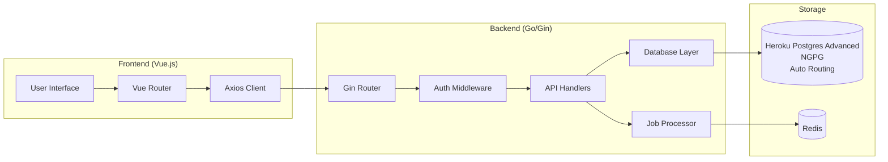

### Key Components

#### 1. **Frontend (Vue.js)**
- **Location**: `web/frontend/`
- **Purpose**: Single Page Application (SPA) for user interaction
- **Features**:
  - Dashboard with analytics visualization
  - Customer and Account management UI
  - JWT token-based authentication
  - Responsive Bootstrap styling

#### 2. **Backend API (Go/Gin)**
- **Location**: `main.go`, `internal/api/`
- **Purpose**: RESTful API server
- **Features**:
  - JWT authentication
  - CRUD operations for customers and accounts
  - Analytics endpoints
  - Health checks and metrics
  - Swagger documentation

#### 3. **Database Layer**
- **Location**: `internal/db/`
- **Purpose**: Database connection and query management
- **Components**:
  - `PrimaryDB`: Connection to Heroku Postgres Advanced (NGPG) with automatic routing
  - `AnalyticsDB`: Optional explicit follower pool connection (falls back to PrimaryDB if not set)
- **NGPG Automatic Routing**: With Heroku Postgres Advanced, a single connection automatically routes writes to the leader and reads to the follower pool

#### 4. **Background Jobs**
- **Location**: `internal/jobs/`
- **Purpose**: Asynchronous task processing
- **Queue System**: Redis with Asynq

---

## Leader/Follower Database Pattern

### Overview

The application implements a **leader/follower (primary/replica)** database pattern to optimize read-heavy analytics queries while maintaining write performance on the primary database.

### Pattern Benefits

1. **Performance**: Offloads read-only analytics queries to follower pool
2. **Scalability**: Reduces load on primary database
3. **Availability**: Follower can serve reads if primary is temporarily unavailable
4. **Graceful Degradation**: Falls back to primary if follower is not configured

### Architecture Diagram

**With Heroku Postgres Advanced (NGPG) - Automatic Routing:**

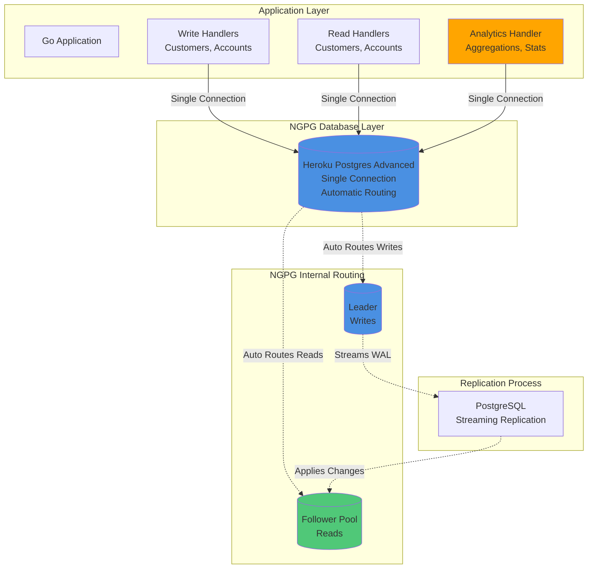

**Note**: The application also supports explicit two-connection routing for legacy Postgres tiers or when fine-grained control is needed.

### Key Implementation Points

#### 1. **Database Initialization**

**Important Note on Heroku Postgres Advanced (Next Generation)**:
With [Heroku Postgres Advanced](https://www.heroku.com/blog/introducing-the-next-generation-of-heroku-postgres/), the follower pool architecture can automatically route read queries to followers and write queries to the leader through a single connection string. This means you may only need `DATABASE_URL` if your follower pool is configured for automatic read distribution.

However, this application implements an **explicit two-connection approach** for fine-grained control:

```go
// Primary database (required)
PrimaryDB *sql.DB  // Connected via DATABASE_URL

// Analytics database (optional)
AnalyticsDB *sql.DB  // Connected via ANALYTICS_DB_URL
```

**Why Two Connections?**
- **Explicit Control**: Choose exactly which queries go to follower vs leader
- **Legacy Compatibility**: Works with all Heroku Postgres tiers (Standard, Premium, Advanced)
- **Fine-Grained Routing**: Analytics queries explicitly use follower, transactional reads use primary
- **Future Flexibility**: Can easily switch between automatic and explicit routing

**Initialization Flow**:
1. `InitPrimaryDB()` - Always connects to primary database via `DATABASE_URL`
2. `InitAnalyticsDB()` - Attempts to connect to follower pool
   - If `ANALYTICS_DB_URL` is set → Connects to follower pool explicitly
   - If not set → Falls back to `PrimaryDB` reference (uses primary for analytics)

**Alternative: Single Connection with Next Gen Postgres Advanced**
If you're using Heroku Postgres Advanced with automatic read routing configured, you can use only `DATABASE_URL` and the database will automatically route:
- Write operations → Leader
- Read operations → Follower pool (if configured)

In this case, you would modify the code to use a single connection for all operations, and the database layer handles the routing automatically.

#### 2. **Query Routing Logic**

**With NGPG Automatic Routing** (Recommended):
The database automatically routes queries through a single connection:

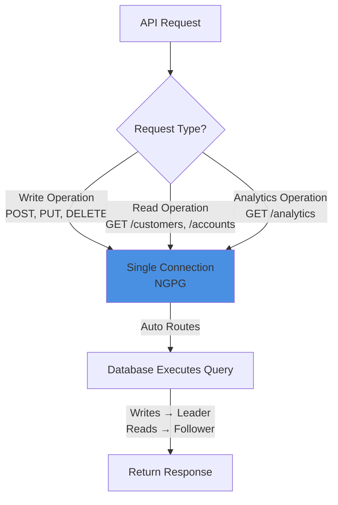

**With Explicit Routing** (Legacy/Advanced Control):
The application explicitly chooses which database connection to use:

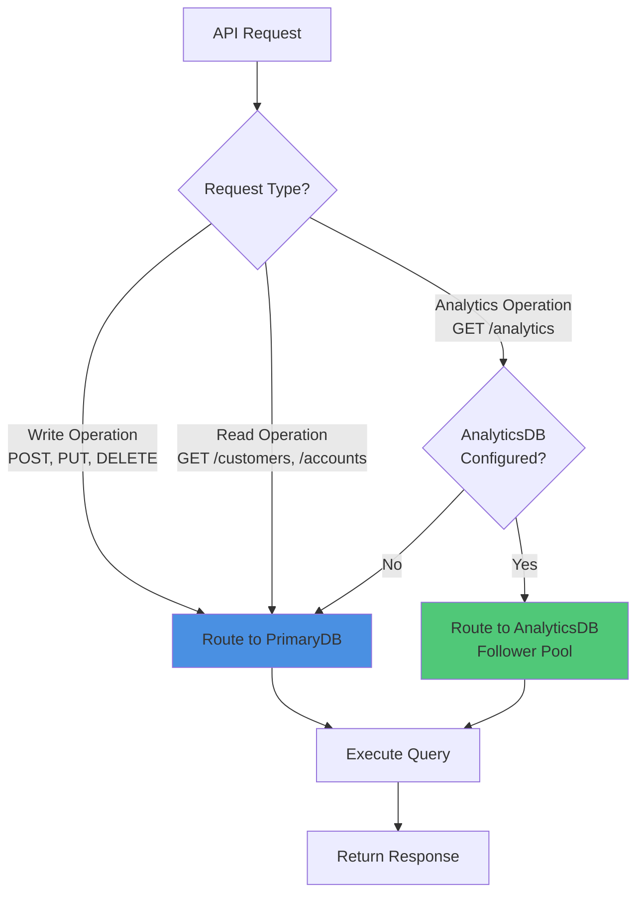

#### 3. **Code Implementation**

**Analytics Handler** (`internal/api/analytics_handler.go`):
```go
func GetAnalytics(c *gin.Context) {
    // Use analytics DB (follower pool) for read-only analytics queries
    analyticsDB := db.AnalyticsDB
    if analyticsDB == nil {
        analyticsDB = db.PrimaryDB  // Fallback to primary
    }
    
    // Execute read-only queries on follower pool
    analyticsDB.QueryRow("SELECT COUNT(*) FROM customers")
    // ...
}
```

**CRUD Handlers** (`internal/api/customer_handler.go`, `account_handler.go`):
```go
func CreateCustomer(c *gin.Context) {
    // All writes go to primary database
    db.PrimaryDB.Exec("INSERT INTO customers ...")
    // ...
}
```

### Replication Details

#### Heroku Postgres Advanced (Next Generation)

[Heroku Postgres Advanced](https://www.heroku.com/blog/introducing-the-next-generation-of-heroku-postgres/) introduces a proprietary follower pool architecture that provides:

- **Automatic Read Distribution**: A single connection string can automatically route reads to followers and writes to the leader
- **Named Follower Pools**: Organize database topology by attaching follower pools to specific applications
- **Zero-Downtime Scaling**: Scale replicas horizontally or vertically without disrupting applications
- **High Performance**: Over 4X throughput improvements and support for 200TB+ storage

**Connection Approaches**:

1. **Automatic Routing (Next Gen Postgres Advanced)**:
   - Use only `DATABASE_URL` 
   - Database automatically routes writes to leader, reads to follower pool
   - Requires follower pool to be configured in Heroku Dashboard
   - Simplest approach, but less explicit control

2. **Explicit Routing (Current Implementation)**:
   - Use `DATABASE_URL` for primary/leader
   - Use `ANALYTICS_DB_URL` for follower pool (explicit connection)
   - Application code explicitly chooses which database to query
   - More control, works with all Postgres tiers

#### PostgreSQL Streaming Replication

**With NGPG Automatic Routing:**

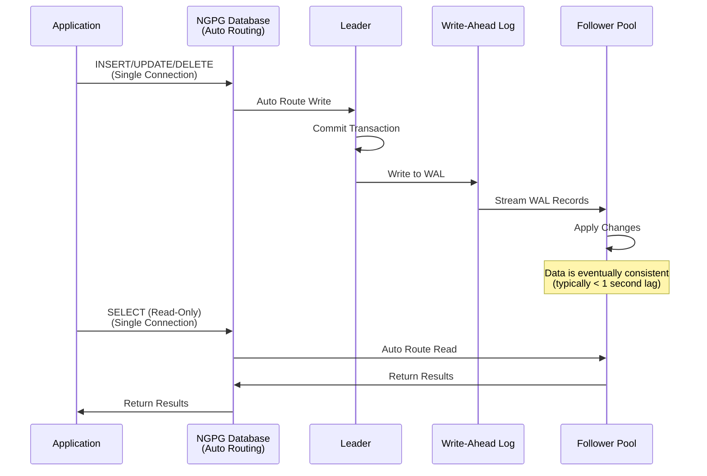

**With Explicit Routing (Legacy):**

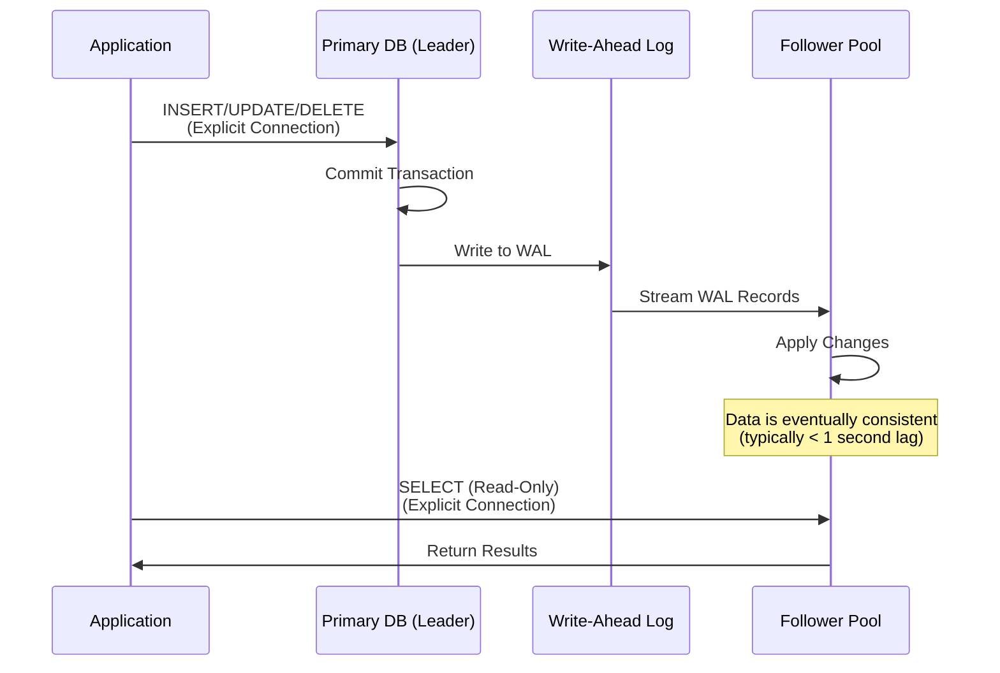

**Replication Characteristics**:
- **Type**: Asynchronous streaming replication
- **Lag**: Typically < 1 second (depends on network and load)
- **Consistency**: Eventually consistent (reads may see slightly stale data)
- **Failover**: Automatic promotion to leader if primary fails (Heroku managed)

---

## Data Flow

### Write Operations Flow

**With NGPG (Automatic Routing):**

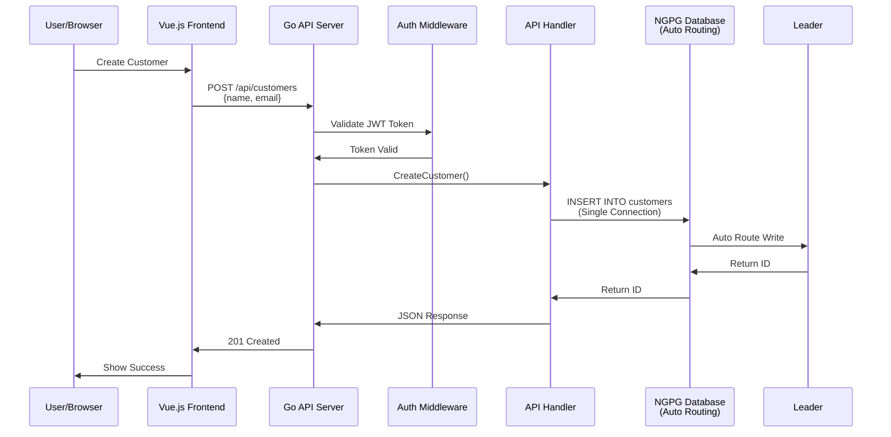

### Read Operations Flow (CRUD)

**With NGPG (Automatic Routing):**

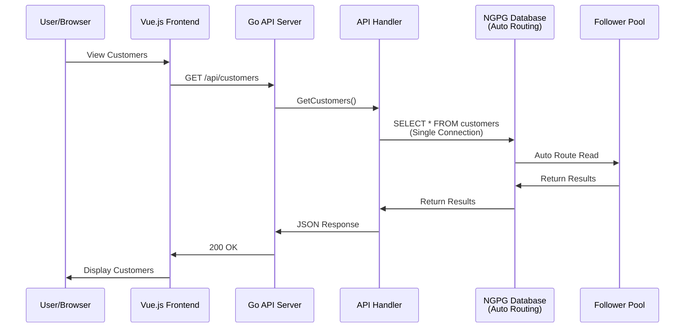

### Analytics Operations Flow

**With NGPG (Automatic Routing):**

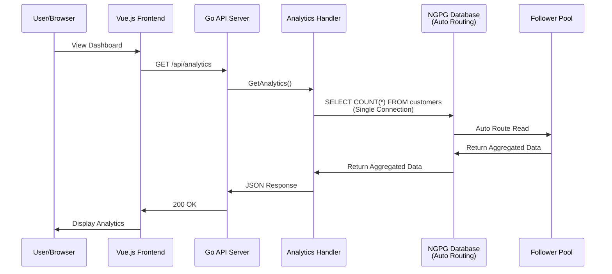

**Note**: With explicit routing (legacy), analytics queries would explicitly use a separate follower pool connection if `ANALYTICS_DB_URL` is configured.

---

## Request Routing

### API Endpoint Classification

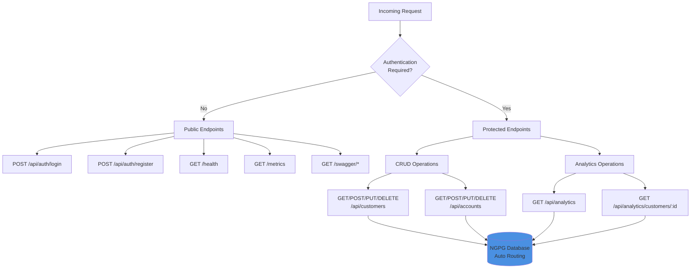

### Database Selection Matrix

| Endpoint | Method | Database | Reason |
|----------|--------|----------|--------|
| `/api/auth/login` | POST | Primary | Write operation (session tracking) |
| `/api/auth/register` | POST | Primary | Write operation (user creation) |
| `/api/customers` | GET | Primary | Read operation (transactional data) |
| `/api/customers` | POST | Primary | Write operation |
| `/api/customers/:id` | GET | Primary | Read operation (transactional data) |
| `/api/customers/:id` | PUT | Primary | Write operation |
| `/api/customers/:id` | DELETE | Primary | Write operation |
| `/api/accounts` | GET | Primary | Read operation (transactional data) |
| `/api/accounts` | POST | Primary | Write operation |
| `/api/accounts/:id` | GET | Primary | Read operation (transactional data) |
| `/api/accounts/:id` | PUT | Primary | Write operation |
| `/api/accounts/:id` | DELETE | Primary | Write operation |
| `/api/analytics` | GET | **NGPG (Auto Routes to Follower)** | Read-only aggregation (can tolerate slight lag) |
| `/api/analytics/customers/:id` | GET | **NGPG (Auto Routes to Follower)** | Read-only aggregation (can tolerate slight lag) |

**Key Decision Points (NGPG Automatic Routing)**:
- **All Operations** → Single NGPG connection
- **Writes** → Automatically routed to Leader by NGPG
- **Reads** → Automatically routed to Follower Pool by NGPG (if configured)
- **Transactional Reads** → May go to Leader for consistency (NGPG decision)
- **Analytics Reads** → Routed to Follower Pool (NGPG decision)

**Note**: With explicit routing (legacy), the application explicitly chooses which database connection to use.

---

## Database Connection Management

### Connection Initialization

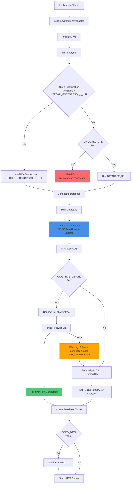

### Connection Pool Management

The application uses Go's `database/sql` package which provides built-in connection pooling:

- **Connection Pool**: Managed automatically by `sql.DB`
- **Max Open Connections**: Default (unlimited, but PostgreSQL has limits)
- **Max Idle Connections**: Default (2)
- **Connection Lifetime**: Managed by PostgreSQL server settings

**Best Practices**:
- Connections are reused across requests
- Idle connections are kept alive for quick reuse
- Connections are automatically closed when the application shuts down

---

## Background Jobs

### Architecture

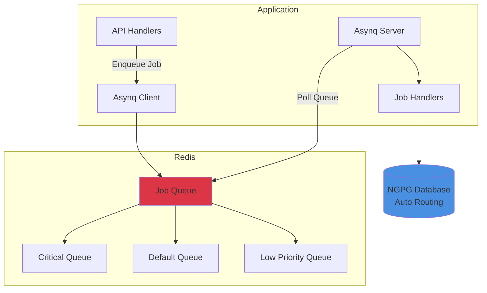

### Job Processing Flow

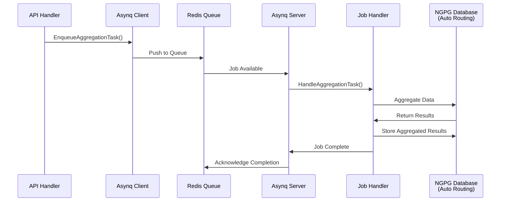

### Queue Priorities

The application uses three priority queues:

1. **Critical Queue** (Priority 6): High-priority tasks
2. **Default Queue** (Priority 3): Standard tasks
3. **Low Queue** (Priority 1): Background processing

**Configuration** (`main.go`):
```go
asynq.Config{
    Concurrency: 10,
    Queues: map[string]int{
        "critical": 6,
        "default":  3,
        "low":      1,
    },
}
```

---

## Authentication & Authorization

### JWT Authentication Flow

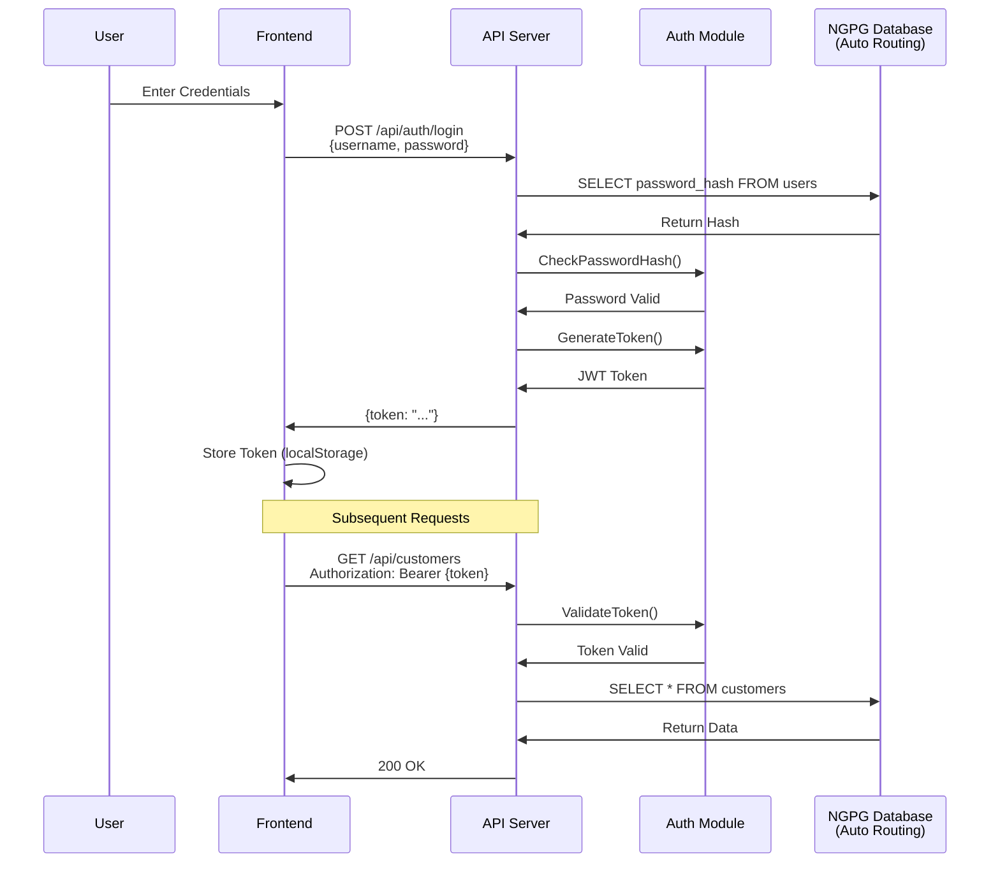

### Middleware Protection

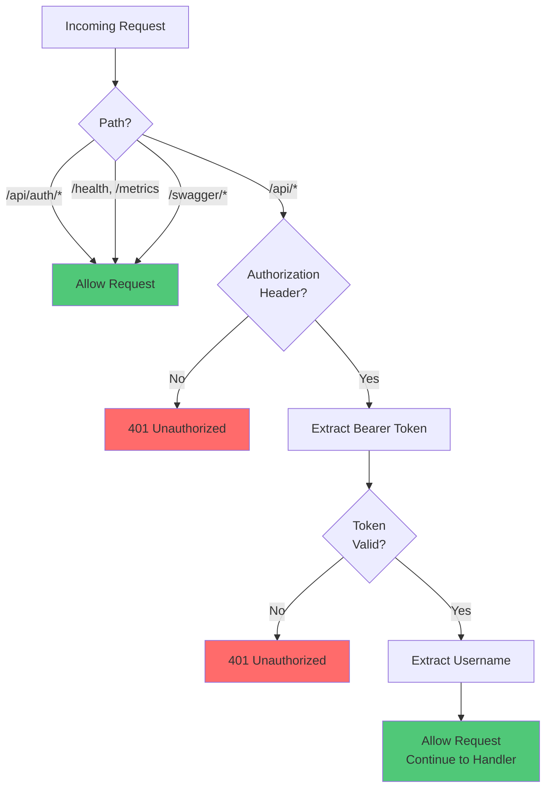

---

## Deployment Architecture

### Heroku Deployment

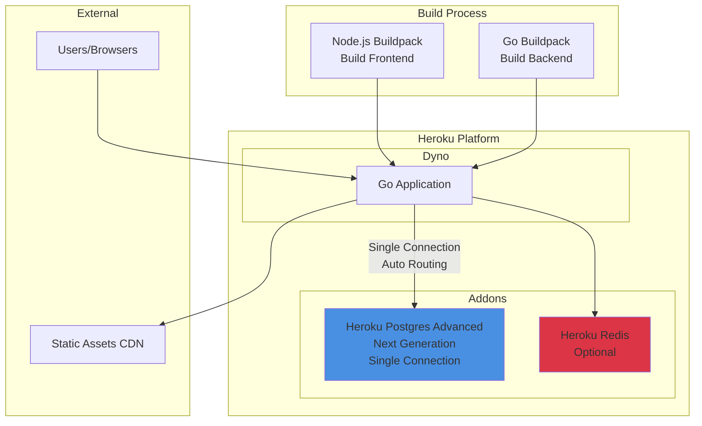

### Environment Configuration

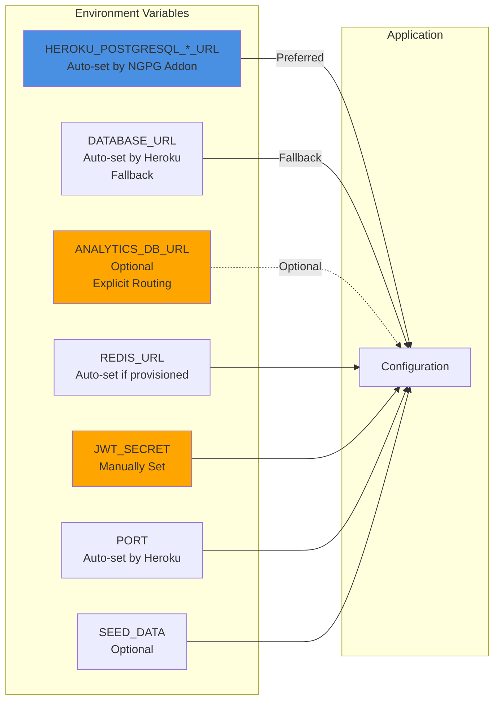

---

## Key Architectural Decisions

### 1. **Why Leader/Follower for Analytics?**

**Problem**: Analytics queries (COUNT, AVG, aggregations) can be resource-intensive and slow down transactional operations.

**Solution**: Route analytics queries to a read-only follower pool.

**Benefits**:
- Primary database remains responsive for transactional operations
- Analytics queries don't block writes
- Can scale analytics independently
- Follower pool can be optimized for read-heavy workloads

**Trade-offs**:
- Slight replication lag (typically < 1 second)
- Additional infrastructure cost
- More complex connection management

### 1a. **Why Explicit Two-Connection Approach vs. Automatic Routing?**

**Decision**: This application uses explicit two-connection routing (`DATABASE_URL` + `ANALYTICS_DB_URL`) rather than relying on automatic routing from a single connection.

**Reasoning**:
- **Explicit Control**: We want to explicitly route analytics queries to followers, while keeping transactional reads on the primary for consistency
- **Legacy Compatibility**: Works with all Heroku Postgres tiers, not just Advanced
- **Clear Intent**: Code clearly shows which queries use which database
- **Flexibility**: Can easily switch to automatic routing later if desired

**Alternative Approach (Next Gen Postgres Advanced)**:
With Heroku Postgres Advanced, you can use a single `DATABASE_URL` connection string that automatically routes:
- Writes → Leader
- Reads → Follower pool (if configured)

This simplifies connection management but provides less explicit control over query routing. The current implementation can be modified to use this approach if desired.

### 2. **Why Not Use Follower for All Reads?**

**Decision**: Only use follower pool for analytics, not for transactional reads.

**Reasoning**:
- Transactional reads (GET /api/customers/:id) need the latest data
- Users expect to see their changes immediately
- Analytics can tolerate slight lag (counts, averages)
- Simpler mental model: "writes and transactional reads → primary, analytics → follower"

### 3. **Graceful Degradation**

**Implementation**: If `ANALYTICS_DB_URL` is not set, analytics endpoints use the primary database.

**Benefits**:
- Application works without follower pool (development, small deployments)
- No code changes needed to enable/disable follower pool
- Easy to test locally with single database

### 4. **Connection Management**

**Decision**: Use separate connection pools for primary and follower.

**Benefits**:
- Independent connection limits
- Can tune each pool separately
- Clear separation of concerns
- Easy to monitor connection usage per database

---

## Monitoring & Observability

### Health Check Endpoint

The `/health` endpoint reports the status of both database connections:

```json
{
  "status": "healthy",
  "database": "connected",
  "analytics_db": "connected"  // or "using primary" if not configured
}
```

### Metrics Endpoint

The `/metrics` endpoint provides Prometheus-compatible metrics for:
- HTTP request counts
- Response times
- Error rates
- Database connection pool stats (if instrumented)

---

## Future Enhancements

### Potential Improvements

1. **Support for Next Gen Postgres Advanced Automatic Routing**
   - Add option to use single `DATABASE_URL` with automatic read/write routing
   - Leverage Heroku Postgres Advanced's proprietary follower pool architecture
   - Simplify connection management while maintaining performance benefits
   - Reference: [Heroku Postgres Advanced](https://www.heroku.com/blog/introducing-the-next-generation-of-heroku-postgres/)

2. **Connection Pooling Configuration**
   - Make connection pool sizes configurable
   - Add metrics for connection pool usage

3. **Read Replicas for Transactional Reads**
   - Add option to route some transactional reads to follower
   - Implement read preference based on consistency requirements

4. **Caching Layer**
   - Add Redis caching for frequently accessed data
   - Cache analytics results with TTL

5. **Database Sharding**
   - Partition customers/accounts by region or ID range
   - Route queries to appropriate shard

6. **Event Sourcing**
   - Store events instead of current state
   - Rebuild analytics from event stream

---

## Conclusion

The SaaS Go App implements a clean separation between transactional operations and analytics queries through the leader/follower database pattern. This architecture provides:

- **Performance**: Optimized read and write operations
- **Scalability**: Can scale reads independently from writes
- **Reliability**: Graceful degradation if follower pool is unavailable
- **Simplicity**: Clear routing logic and easy to understand

The application is designed to work with or without a follower pool, making it suitable for both development and production environments.

**Note on Heroku Postgres Advanced**: With [Heroku Postgres Advanced (Next Generation)](https://www.heroku.com/blog/introducing-the-next-generation-of-heroku-postgres/), you can use a single connection string that automatically routes reads to followers and writes to the leader. The current implementation uses explicit two-connection routing for fine-grained control, but can be adapted to use automatic routing if desired.

